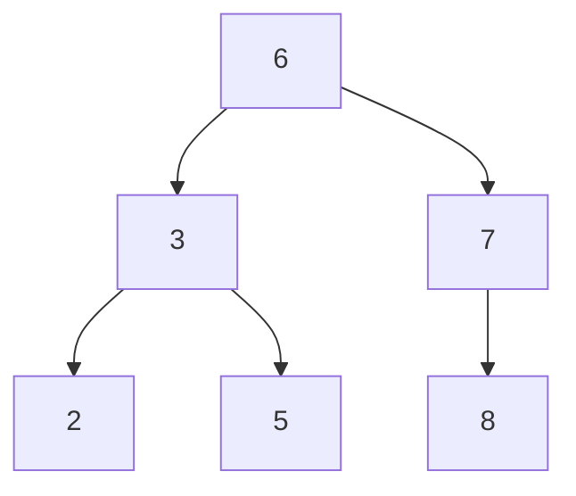
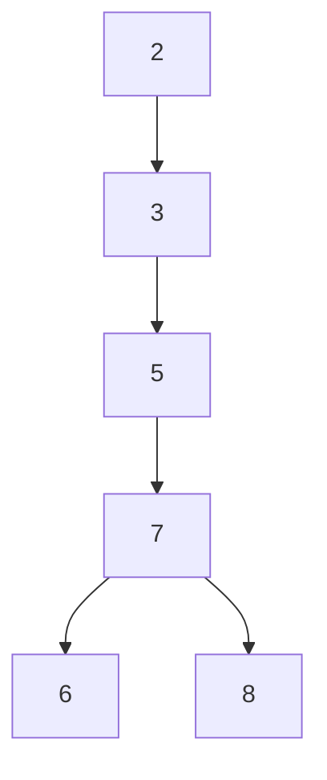

### 索引概述

InnoDB支持以下索引：B+ 树索引、Hash索引、全文索引

B+ 树索引并不能找到一个给定键值的具体行，只是被查找数据行所在的页。然后数据库通过把页读取到内存中，再在内存中查找。

### 数据结构与算法

#### 二分查找法

二分查找法（binary serach）也称为折半查找法，基本思想是：将记录按有序化（递增或递减）排列，在查找过程中采用跳跃式方法查找，即先以有序数列的中点位置为比较对象，如果查找的元素小于该中点元素，则将带查找序列缩短为左半部分，否则为右半部分。

#### 二叉查找树和平衡二叉树

二叉查找树：

在二叉查找树中，左子树的键值总是小于根的键值，右子树的键值总是大于根的键值。因此可以通过中序遍历得到键值的排序输出。二叉查找树比顺序查找来得更快。

但如果同样的序列，一下二叉查找树效率很低，从而引出了平衡二叉树，也称 AVL 树。

平衡二叉树：首先满足二叉查找树定义，其次必须满足任何节点的两个子树的高度最大差为1。