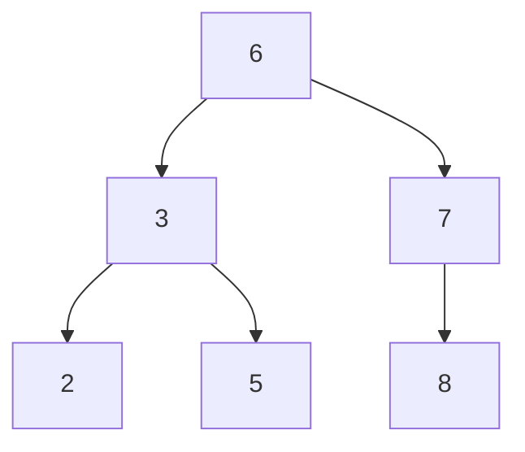
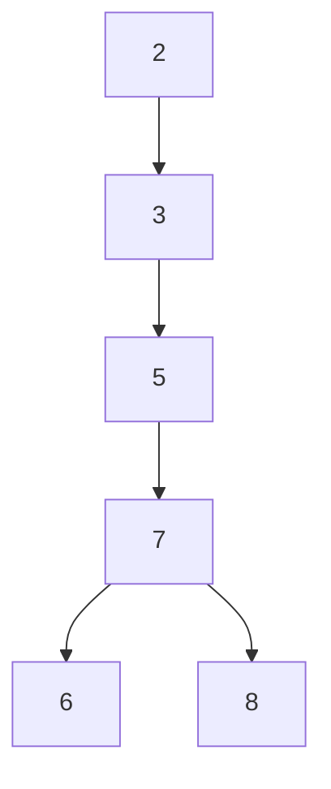

### 索引概述

InnoDB支持以下索引：B+ 树索引、Hash索引、全文索引

B+ 树索引并不能找到一个给定键值的具体行，只是被查找数据行所在的页。然后数据库通过把页读取到内存中，再在内存中查找。

### 数据结构与算法

#### 二分查找法

二分查找法（binary serach）也称为折半查找法，基本思想是：将记录按有序化（递增或递减）排列，在查找过程中采用跳跃式方法查找，即先以有序数列的中点位置为比较对象，如果查找的元素小于该中点元素，则将带查找序列缩短为左半部分，否则为右半部分。

#### 二叉查找树和平衡二叉树

二叉查找树：

在二叉查找树中，左子树的键值总是小于根的键值，右子树的键值总是大于根的键值。因此可以通过中序遍历得到键值的排序输出。二叉查找树比顺序查找来得更快。

但如果同样的序列，一下二叉查找树效率很低，从而引出了平衡二叉树，也称 AVL 树。

平衡二叉树：首先满足二叉查找树定义，其次必须满足任何节点的两个子树的高度最大差为1。

平衡二叉树的查找速度快，但维护一颗平衡二叉树的代价非常大，通常需要一次或多次左旋或右旋操作来得到插入或更新后数的平衡性。

### B+ 树

B+ 树是一种树数据结构，是一个n叉树，每个节点通常有多个孩子，一颗B+树包含根节点、内部节点和叶子节点。所有记录节点都是按键值的大小顺序存放在同一层的叶子节点上，由各叶子节点指针进行连接。B+ 树通常用于数据库和操作系统的文件系统中。 B+ 树的特点是能够保持数据稳定有序，其插入与修改拥有较稳定的对数时间复杂度。 B+ 树元素自底向上插入。

    <image src="img/5.bmp"></image>

### B+ 树索引

数据库中的B+ 树索引分为聚集索引和辅助索引，区别是叶子节点是否存放一整行信息。

#### 聚集索引

按照每张表的主键构造一颗B+ 树，同时叶子节点中存放的即为整张表的行数据，同B+ 树数据结构一样，每个数据页都通过双向链表进行链接。

每张表只能有一个聚集索引，此外，由于定义了数据的逻辑顺序，聚集索引能够特别快速的针对范围值的查询。

#### 辅助索引

叶子节点并不包含行记录的全部数据，叶子节点除了包含键值以外，每个叶子节点的索引行中还包含了一个书签。该书签用来告诉InnoDB存储引擎哪里可以找到与索引相对应的行数据。

由于InnoDB存储引擎是**索引组织表**，因此其辅助索引的书签就是相应行数据的聚集索引键。

> 索引组织表(index organized table, IOT) 就是存储在一个索引结构中的表。普通索引只存储索引列，而索引组织表则存储表的所有列的值。

非聚集索引需要两次查找，先从非聚集索引中找到主键值，然后再去聚集索引中找到具体数据。
聚集索引只需要查找本身

为什么重复较高的字段不适合做索引

一个表可能会涉及两个数据结构(文件)，一个是表本身，存放表中的数据，另一个是索引。索引是什么？它就是把一个或几个字段（组合索引）按规律排列起来，再附上该字段所在行数据的物理地址（位于表中）。比如我们有个字段是年龄，如果要选取某个年龄段的所有行，那么一般情况下可能需要进行一次全表扫描。但如果以这个年龄段建个索引，那么索引中会按年龄值建一个排列，这样在索引中就能迅速定位，不需要进行全表扫描。

为什么性别不适合建索引呢？因为你访问索引需要付出额外的IO开销，你从索引中拿到的只是地址，要想真正访问到数据还是要对表进行一次IO。假如你要从表的100万行数据中取几个数据，那么利用索引迅速定位，访问索引的这IO开销就非常值了。但如果你是从100万行数据中取50万行数据，就比如性别字段，那你相对需要访问50万次索引，再访问50万次表，加起来的开销并不会比直接对表进行一次完整扫描小。

当然凡事不是绝对，如果把性别字段设为表的聚集索引，那么就肯定能加快大约一半该字段的查询速度了。

### 哈希算法

#### 哈希表

哈希表（Hash table）也称散列表，由直接寻址表改进而来。它通过把关键码值映射到表中一个位置来访问记录，以加快查找的速度。这个映射函数叫做散列函数，存放记录的数组叫做散列表。

#### InnoDB中的哈希算法

InnoDB使用哈希算法来对字典数据进行查找，其冲突机制采用链表方式。

### 全文检索

B+ 树索引不能很好的对全文进行关键字匹配查找，全文检索是将存储在数据库中的整本书或整篇文章中的任意信息查找出来的技术。

全文检索通常采用**倒排索引**来实现，它在辅助表中存储了单词与单词自身在一个或多个文档中所在位置之间的映射。这通常利用关联数组实现，其拥有两种表现形式：

- inverted file index，表现为 {单词，单词所在文档id}
- full inverted text，表现为 {单词，（单词所在文档id，在具体文档中的位置）}

